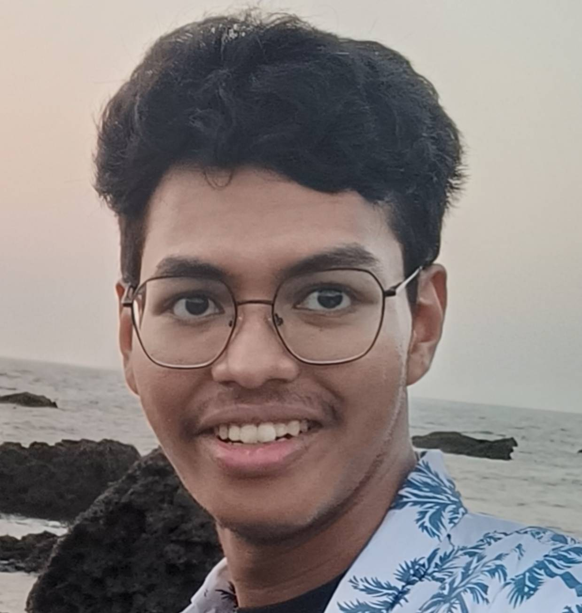
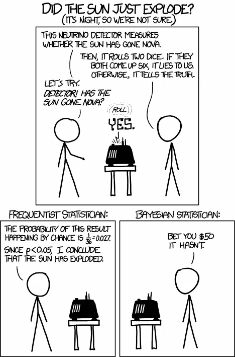

> "Our deepest fear is not that we are inadequate. Our deepest fear is that we are powerful beyond measure. It is our light, not our darkness, that most frightens us." - Marianne Williamson

## about Me

hi! i’m avinab. i graduated last year from bits goa with a major in mechanical engineering. along the way, i also took up courses in data science and finance to broaden my perspective. i was a core member of the cybersec club at bits goa, where i got hands-on with security and tech. my research interests lie in nlp and mechanistic interpretability.

hit me up if you've got a cool idea regarding any of those and wish to collaborate!

## present

* completing the [arena](https://www.arena.education/) coursework, we have a self study group over from arena slack, feel free to [join](https://calendar.app.google/xSHwNtnrtjYHWS3K6) in!

* life?

* working on the r-dev container as a part of gsoc.

* implementing [isl](https://www.statlearning.com/) in r and python.

## past

* after completing school last year in 2024, i joined [forma.ai](https://www.forma.ai/) as an operations data analyst, where i got the opportunity to speak with sales leadership and work on a few ml implementations in the product.

* while in college, i managed the finances for the [sports fest](https://bits-spree.org/) in 2023. it was a daunting task and came with its fair share of real-life lessons.

* i interned with the business intelligence team at [licious](https://www.licious.in/) as a data analyst/scientist, where i learned how the business works. during my time there, i visited all operational levels from the production centers to the hubs and received a return offer.

* was part of my school quiz club, which was one of the most fun periods of my life. leaving for another town for a national quiz when you have your pre-boards the next day was an amazing feeling!

* qualified for the rmo back in 2018.

## future

* [mats](https://www.matsprogram.org/? 

* masters?

* more research?

* ...

## random

* whiteboards help me think better. the bigger, the better. 

* i love going out for trips/treks and exploring different cultures/environments!

* i recently got a sub cross 30 and have done some long rides, max was sub 100 km though.

* i am learning german

* indian food (bengali food has a special bias) > all other cuisines. please change my mind. 

* airbnb > hotels. can't change my mind.

* anime > everything else. 

* coldplay is <3 

## publications

Hopefully coming soon!

